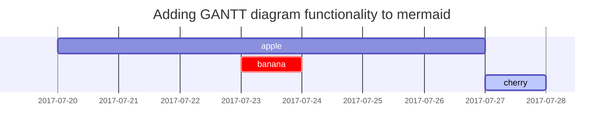

## 소프트웨어의 특징
- 제조가 아닌 개발  
  * 제조: 만드는 방법이 정해져 있음, 개인 능력에 따른 결과물의 차이가 크지 않음.  
  * 개발: 개인 능력에 따라 결과물의 차이가 큼 (소요되는 시간, 비용, 결과물의 성능).  

- 소모가 아닌 품질 저하  
  * 하드웨어: 오래 사용하면 부품이 닳고 기능이 떨어짐.  
  * 소프트웨어: 시간이 지나도 닳지 않음, 시작 단계부터 요구가 계속 발생.  

## 대규모 소프트웨어 개발의 어려움  
- 개발 과정이 복잡  
  * 복잡할수록 문제가 많이 발생  
    => 개발의 복잡함을 줄이기 위한 방법 필요  
- 참여 인력이 많음.  
  * 의사소통 결오가 많아짐  
  * 의사결정 과정 복잡, 협력이 쉽지 않음, 도중에 떠나는 사람, 새로 들어온 사람...  
    => 개발팀을 구성하고 관리하는 방법 필요  
- 긴 개발 기간
  * 프로젝트 진행 상황을 파악하기 어려움
  * 개발 비용 산정이 어려움  
    => 프로젝트를 관리하기 위한 체계 필요

### 소프트웨어 개발 프로세스 모델
  - 소프트웨어를 어떻게 개발할 것인가에 대한 전체 흐름을 체계화한 것  
  - 개발 계획 수립부터 최종 폐기까지의 전 과정을 다룸  
  - 고품질의 소프트웨어 제품을 만드는 것이 목적  
  - 예산과 자원으로 효율적으로 이용하도록 개발하고 관리하는 방법을 제시  
### 소프트웨어 개발 프로세스 모델의 역할
  * 프로젝트에 대한 전체적인 기본 골격을 세워주며
  * 기본 골격을 통해 일정 계획을 수립할 수 있고, 용어의 표준화를 가능하게 함
  * 개발 진행 상황도 명확히 파악할 수 있고, 각 단계별로 생성되는 문서를 포함한 산출물을 활용해 프로젝트를 검토할 수 있게 함.  

## 소프트웨어 개발 프로세스 모델들
`주먹구구식 모델` `폭포수 모델` `V모델` `애자일 모델`
  <li> <strong>주먹구구식 모델</strong>
    <ul>공식적인 가이드라인이나 프로세스가 없는 개발 방식, 즉흥적 소프트웨어 개발.</ul>
    <ul>코드를 작성해 제품을 만든 후에 요구 분석, 설계, 유지보수에 대해 생각.</ul>
    <ul>일단 코드를 작성해 완성한 뒤 문제가 있으면 수정하고 문제가 없으면 사용.</ul>
  </li>
  <li> <strong>주먹구구식 모델의 단점</strong>
    <ul>정해진 개발 순서나 각 단계별 산출물이 없어, 관리 및 유지보수가 어려움..</ul>
    <ul>프로젝트 전체 범위를 알 수 없을 뿐더러 좋은 아키텍처를 만들 수도 없음.</ul>
    <ul>개발자가 일을 효과적으로 나눠 할 수도 없음.</ul>
    <ul>프로젝트 진척 상황을 거의 파악할 수 없음.</ul>
    <ul>코딩을 먼저 하므로 계속 수정할 가능성이 높은데, 여러 번 수정하다 보면 가독성이 높았던 프로그램의 구조가 나빠져 수정이 매우 어려워 짐.</ul>
  </li>

  <li> <strong>폭포수 모델</strong>
      <ul>선형 순차적 모델 폭포에서 물이 떨어지듯이 다음 단계로 넘어가는 모델.</ul>
      <ul>소프트웨어 공학의 대명사로 여겨질 만큼 초기에 개발된 전통적인 모델.</ul>
      <ul>공장 생산 라인의 작업 프로세스와 유사한데, 표준 프로세스를 정해 소프트웨어를 순차적으로 개발.</ul>
  </li>
  <li> <strong>폭포수 모델의 개발 절차</strong>
    <ul>계획, 분석, 설계, 구현, 테스트, 유지보수의 각 단계가 하향식으로 진행.</ul>
    <ul>각 단계가 끝날 때마다 확실히 매듭을 짓고, 결과 확인 후에 다음 단계로 나감.</ul>
    <ul>요구사항 분석 단계가 끝나면 '요구분석명세서'라는 문서를 작성.</ul>
    <ul>명세서를 기준으로 사용자에게 이상 유무를 확인 받고 설계 절차 진행.</ul>
  </li>
  <li> <strong>폭포수 모델의 단점</strong>
    <ul>각 단계는 앞 단계가 완료되어야 수행할 수 있음.</ul>
    <ul>각 단계의 결과물이 완벽하게 작성되어야 다음 단계에 오류를 넘겨주지 않음.</ul>
    <ul>사용자가 중간에 가시적인 결과를 볼 수 없어 답답해 할 수 있음.</ul>
    <ul>개발 중간에 문제를 찾아내면 앞 단계(들)을 수정해야 함.</ul>
  </li>

  <li> <strong>V모델</strong> `폭포수 모델의 변형`
    <ul>테스트 단계를 추가하여 각 단계에서 발생할 수 있는 오류를 줄임.</ul>
    <ul>폭포수 모델은 산출물을 중시. & V 모델은 각 개발 단계 겸증을 중시.</ul>
  </li>

## 애자일 모델


## Lists

### Ordered list

1. Firstly
2. Secondly
3. Thirdly

### Unordered list

- Chapter
  - Section
    - Paragraph

### ToDo list

- [ ] Job
  - [x] Step 1
  - [x] Step 2
  - [ ] Step 3

### Description list

Sun
: the star around which the earth orbits

Moon
: the natural satellite of the earth, visible by reflected light from the sun

## Block Quote

> This line shows the _block quote_.

## Prompts

<!-- markdownlint-capture -->
<!-- markdownlint-disable -->
> An example showing the `tip` type prompt.
{: .prompt-tip }

> An example showing the `info` type prompt.
{: .prompt-info }

> An example showing the `warning` type prompt.
{: .prompt-warning }

> An example showing the `danger` type prompt.
{: .prompt-danger }
<!-- markdownlint-restore -->

## Tables

| Company                      | Contact          | Country |
| :--------------------------- | :--------------- | ------: |
| Alfreds Futterkiste          | Maria Anders     | Germany |
| Island Trading               | Helen Bennett    |      UK |
| Magazzini Alimentari Riuniti | Giovanni Rovelli |   Italy |

## Links

<http://127.0.0.1:4000>

## Footnote

Click the hook will locate the footnote[^footnote], and here is another footnote[^fn-nth-2].

## Inline code

This is an example of `Inline Code`.

## Filepath

Here is the `/path/to/the/file.extend`{: .filepath}.

## Code blocks

### Common

```text
This is a common code snippet, without syntax highlight and line number.
```

### Specific Language

```bash
if [ $? -ne 0 ]; then
  echo "The command was not successful.";
  #do the needful / exit
fi;
```

### Specific filename

```sass
@import
  "colors/light-typography",
  "colors/dark-typography";
```
{: file='_sass/jekyll-theme-chirpy.scss'}

## Mathematics

The mathematics powered by [**MathJax**](https://www.mathjax.org/):

$$
\begin{equation}
  \sum_{n=1}^\infty 1/n^2 = \frac{\pi^2}{6}
  \label{eq:series}
\end{equation}
$$

We can reference the equation as \eqref{eq:series}.

When $a \ne 0$, there are two solutions to $ax^2 + bx + c = 0$ and they are

$$ x = {-b \pm \sqrt{b^2-4ac} \over 2a} $$

## Mermaid SVG



## Images

### Default (with caption)

{: width="972" height="589" }
_Full screen width and center alignment_

### Left aligned

{: width="972" height="589" .w-75 .normal}

### Float to left

{: width="972" height="589" .w-50 .left}
Praesent maximus aliquam sapien. Sed vel neque in dolor pulvinar auctor. Maecenas pharetra, sem sit amet interdum posuere, tellus lacus eleifend magna, ac lobortis felis ipsum id sapien. Proin ornare rutrum metus, ac convallis diam volutpat sit amet. Phasellus volutpat, elit sit amet tincidunt mollis, felis mi scelerisque mauris, ut facilisis leo magna accumsan sapien. In rutrum vehicula nisl eget tempor. Nullam maximus ullamcorper libero non maximus. Integer ultricies velit id convallis varius. Praesent eu nisl eu urna finibus ultrices id nec ex. Mauris ac mattis quam. Fusce aliquam est nec sapien bibendum, vitae malesuada ligula condimentum.

### Float to right

{: width="972" height="589" .w-50 .right}
Praesent maximus aliquam sapien. Sed vel neque in dolor pulvinar auctor. Maecenas pharetra, sem sit amet interdum posuere, tellus lacus eleifend magna, ac lobortis felis ipsum id sapien. Proin ornare rutrum metus, ac convallis diam volutpat sit amet. Phasellus volutpat, elit sit amet tincidunt mollis, felis mi scelerisque mauris, ut facilisis leo magna accumsan sapien. In rutrum vehicula nisl eget tempor. Nullam maximus ullamcorper libero non maximus. Integer ultricies velit id convallis varius. Praesent eu nisl eu urna finibus ultrices id nec ex. Mauris ac mattis quam. Fusce aliquam est nec sapien bibendum, vitae malesuada ligula condimentum.

### Dark/Light mode & Shadow

The image below will toggle dark/light mode based on theme preference, notice it has shadows.

{: .light .w-75 .shadow .rounded-10 w='1212' h='668' }
{: .dark .w-75 .shadow .rounded-10 w='1212' h='668' }

## Video



## Reverse Footnote

[^footnote]: The footnote source
[^fn-nth-2]: The 2nd footnote source
